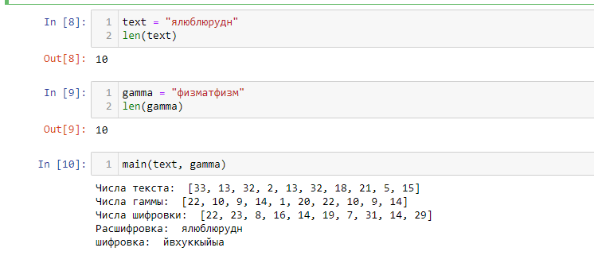

---
# Front matter
title: "Отчёт по лабораторной работе №7"
subtitle: "Шифр гаммирования"
author: "Герра Гарсия Максимиано Антонио "

# Generic otions
lang: ru-RU
toc-title: "Содержание"

# Bibliography
bibliography: bib/cite.bib
csl: pandoc/csl/gost-r-7-0-5-2008-numeric.csl

# Pdf output format
toc: true # Table of contents
toc_depth: 2
lof: true # List of figures
fontsize: 12pt
linestretch: 1.5
papersize: a4
documentclass: scrreprt
## I18n
polyglossia-lang:
  name: russian
  options:
	- spelling=modern
	- babelshorthands=true
polyglossia-otherlangs:
  name: english
### Fonts
mainfont: PT Serif
romanfont: PT Serif
sansfont: PT Sans
monofont: PT Mono
mainfontoptions: Ligatures=TeX
romanfontoptions: Ligatures=TeX
sansfontoptions: Ligatures=TeX,Scale=MatchLowercase
monofontoptions: Scale=MatchLowercase,Scale=0.9
## Biblatex
biblatex: true
biblio-style: "gost-numeric"
biblatexoptions:
  - parentracker=true
  - backend=biber
  - hyperref=auto
  - language=auto
  - autolang=other*
  - citestyle=gost-numeric
## Misc options
indent: true
header-includes:
  - \linepenalty=10 # the penalty added to the badness of each line within a paragraph (no associated penalty node) Increasing the value makes tex try to have fewer lines in the paragraph.
  - \interlinepenalty=0 # value of the penalty (node) added after each line of a paragraph.
  - \hyphenpenalty=50 # the penalty for line breaking at an automatically inserted hyphen
  - \exhyphenpenalty=50 # the penalty for line breaking at an explicit hyphen
  - \binoppenalty=700 # the penalty for breaking a line at a binary operator
  - \relpenalty=500 # the penalty for breaking a line at a relation
  - \clubpenalty=150 # extra penalty for breaking after first line of a paragraph
  - \widowpenalty=150 # extra penalty for breaking before last line of a paragraph
  - \displaywidowpenalty=50 # extra penalty for breaking before last line before a display math
  - \brokenpenalty=100 # extra penalty for page breaking after a hyphenated line
  - \predisplaypenalty=10000 # penalty for breaking before a display
  - \postdisplaypenalty=0 # penalty for breaking after a display
  - \floatingpenalty = 20000 # penalty for splitting an insertion (can only be split footnote in standard LaTeX)
  - \raggedbottom # or \flushbottom
  - \usepackage{float} # keep figures where there are in the text
  - \floatplacement{figure}{H} # keep figures where there are in the text
---

# Цель работы

Изучение алгоритма шифрования гаммированием

# Теоретические сведения

## Шифр гаммирования

Гаммирование – это наложение (снятие) на открытые (зашифрованные) данные криптографической гаммы, т.е. последовательности элементов данных, вырабатываемых с помощью некоторого криптографического алгоритма, для получения зашифрованных (открытых) данных.

Принцип шифрования гаммированием заключается в генерации гаммы шифра с помощью датчика псевдослучайных чисел и наложении полученной гаммы шифра на открытые данные обратимым образом (например, используя операцию сложения по модулю 2). Процесс дешифрования сводится к повторной генерации гаммы шифра при известном ключе и наложении такой же гаммы на зашифрованные данные.
Полученный зашифрованный текст является достаточно трудным для раскрытия в том случае, если гамма шифра не содержит повторяющихся битовых последовательностей и изменяется случайным образом для каждого шифруемого слова. Если период гаммы превышает длину всего зашифрованного текста и неизвестна никакая часть исходного текста, то шифр можно раскрыть только прямым перебором (подбором ключа). В этом случае криптостойкость определяется размером ключа.

Метод гаммирования становится бессильным, если известен фрагмент исходного текста и соответствующая ему шифрограмма. В этом случае простым вычитанием по модулю 2 получается отрезок псевдослучайной последовательности и по нему восстанавливается вся эта последовательность.

Метод гаммирования с обратной связью заключается в том, что для получения сегмента гаммы используется контрольная сумма определенного участка шифруемых данных. Например, если рассматривать гамму шифра как объединение непересекающихся множеств H(j), то процесс шифрования можно пердставить следующими шагами:

1. Генерация сегмента гаммы H(1) и наложение его на соответствующий участок шифруемых данных.

2. Подсчет контрольной суммы участка, соответствующего сегменту гаммы H(1).

3. Генерация с учетом контрольной суммы уже зашифрованного участка данных следующего сегмента гамм H(2).

4. Подсчет контрольной суммы участка данных, соответствующего сегменту данных H(2) и т.д.

# Выполнение работы

## Реализация шифратора и дешифратора Python

```
def main(text, gamma):
    dict = {"а" :1, "б" :2 , "в" :3 ,"г" :4 ,"д" :5 ,"е" :6 ,"ё" :7 ,"ж": 8, "з": 9, "и": 10, "й": 11, "к": 12, "л": 13,
            "м": 14, "н": 15, "о": 16, "п": 17,
            "р": 18, "с": 19, "т": 20, "у": 21, "ф": 22, "х": 23, "ц": 24, "ч": 25, "ш": 26, "щ": 27, "ъ": 28,
            "ы": 29, "ь": 30, "э": 31, "ю": 32, "я": 32
            }
    dict2 = {v: k for k, v in dict.items()}
    digits_text = list()
    digits_gamma = list()
    
    for i in text:
        digits_text.append(dict[i])
    print("Числа текста: ", digits_text)
    
    for i in gamma:
        digits_gamma.append(dict[i])
    print("Числа гаммы: ", digits_gamma)
    
    digits_res = list()
    ch = 0
    for i in text:
        try:
            a = dict[i] + digits_gamma[ch]
        except:
            ch = 0
            a = dict[i] + digits_gamma[ch]
        if a>=33:
            a = a%33
        ch += 1
        digits_res.append(a)
    print("Числа шифровки: ", digits_res)
        
    text_enc = ""
    for i in digits_text:
        text_enc += dict2[i]
    print("Шифровка: ", text_enc)
        
    digits = list()
    for i in text_enc:
        digits.append(dict[i])
    ch = 0
    digits1 = list()
    for i in digits:
        a = i - digits_gamma[ch]
        if a < 1:
            a = 33 + a
        digits1.append(a)
        ch += 1
    text_dec = ""
    for i in digits1:
        text_dec += dict2[i]
    print("Рассшифровка: ", text_dec)
```

## Контрольный пример

{ #fig:001 width=70% height=70%}

# Выводы

Изучили алгоритмы шифрования на основе гаммирования

# Список литературы{.unnumbered}

1. [Шифрование методом гаммирования](http://altaev-aa.narod.ru/security/XOR.html)
2. [Режим гаммирования в блочном алгоритме шифрования](https://kabinfo.ucoz.ru/index/shifr_reshetka_kardano/0-374)